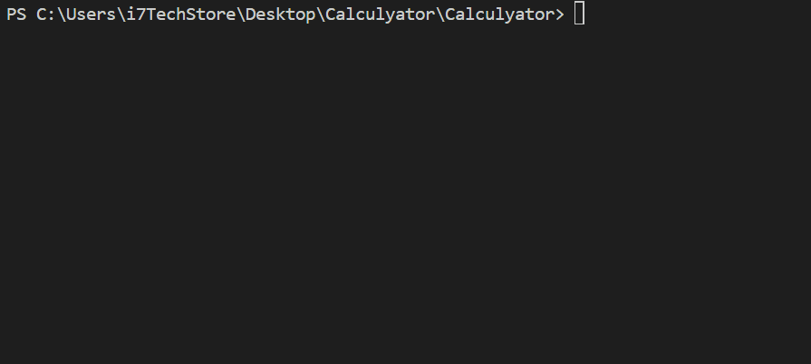

# 📟 C# Console Calculator

Bu loyiha oddiy, lekin to‘liq funksional **C# Console Calculator** dasturidir.  
U quyidagi arifmetik amallarni bajaradi:

- ➕ Qo‘shish  
- ➖ Ayirish  
- ✖️ Ko‘paytirish  
- ➗ Bo‘lish  

---

## 🎥 Demo (GIF)
Quyida kalkulyator ishlashi namoyishi beriladi:


---

## ⚙️ Funktsiyalar

- Foydalanuvchi menyudan amal tanlaydi  
- Ikki son kiritadi  
- Natija avtomatik hisoblanadi  
- 0 ga bo‘lishdan himoya mavjud  
- Dastur cheksiz davom etadi (EXIT tanlanmaguncha)

---

## 🧩 Koddan parcha

```csharp
// Console.WriteLine("=== Calculator ===");
// Console.WriteLine("1. Qo‘shish (+)");
// Console.WriteLine("2. Ayirish (-)");
// Console.WriteLine("3. Ko‘paytirish (*)");
// Console.WriteLine("4. Bo‘lish (/)");
// Console.WriteLine("5. Chiqish");
